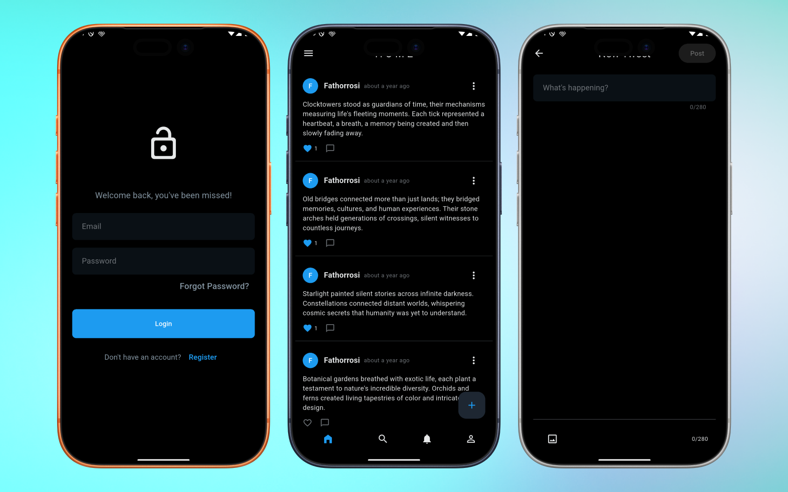
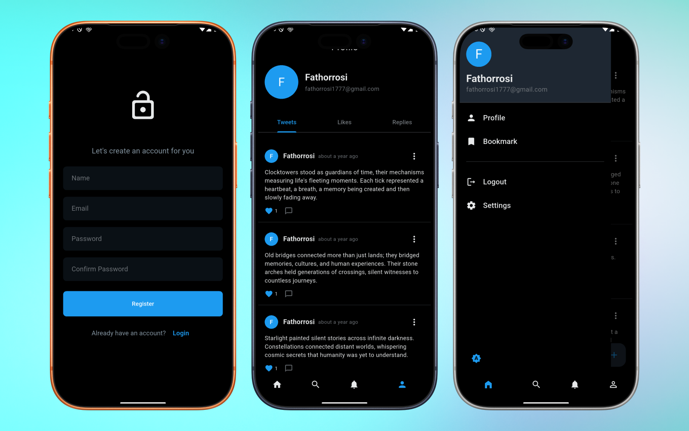
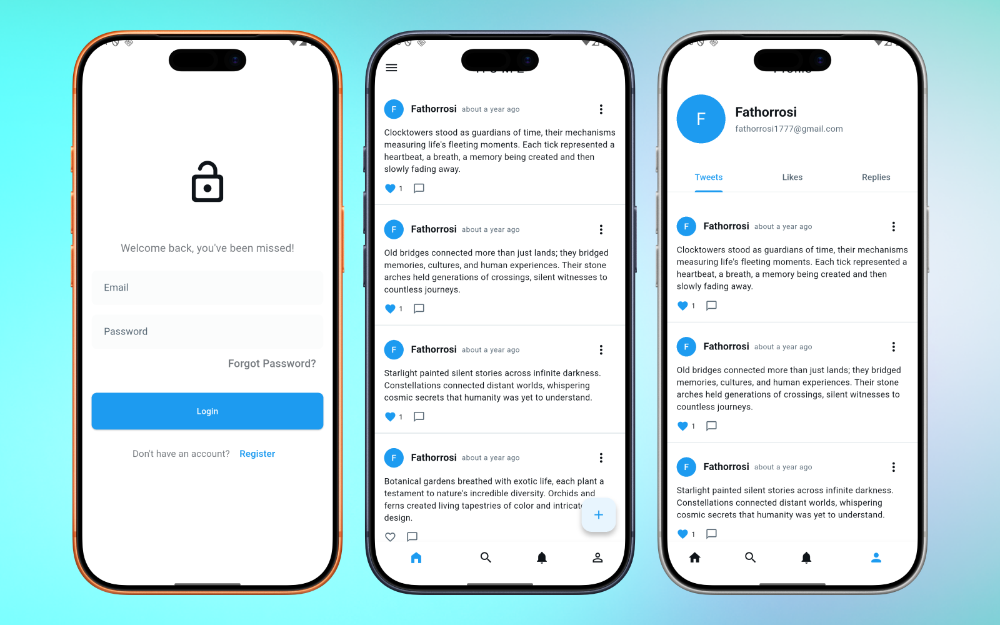

# x_clone

A Flutter app inspired by the Twitter/X experience. This project demonstrates:
- Firebase Auth + Firestore integration
- Clean architecture (presentation / data / domain)
- Bloc-based state management with persistence (hydrated_bloc)
- Dependency injection via get_it
- Responsive UI & routing (go_router)





Table of contents
- [Prerequisites](#prerequisites)
- [Firebase setup](#firebase-setup)
- [Quick start](#quick-start)
- [Code generation](#code-generation)
- [Project structure & architecture](#project-structure--architecture)
- [Key components](#key-components)
- [Example: creating a tweet programmatically](#example-creating-a-tweet-programmatically)
- [Testing](#testing)
- [Troubleshooting](#troubleshooting)
- [Contributing](#contributing)
- [License](#license)

## Prerequisites
- Flutter SDK (stable) — repo uses SDK constraint >= 3.10.7
  - Install from https://docs.flutter.dev/get-started/install
- Dart (bundled with Flutter)
- Firebase project (see below)
- Android Studio / Xcode / VS Code for platform tooling (as needed)
- Optional: Emulator or physical device

## Firebase setup
This app uses Firebase Auth and Cloud Firestore. Before running, configure Firebase:

1. Create a Firebase project at https://console.firebase.google.com/.
2. Enable:
   - Authentication — sign-in method Email/Password.
   - Cloud Firestore — configure rules (start in test mode for development).
3. Add Android app:
   - Package name: check `android/app/src/main/AndroidManifest.xml` for the applicationId.
   - Download `google-services.json` and place it into `android/app/`.
   - Ensure `android/build.gradle.kts` and `android/app/build.gradle.kts` have the Google Services plugin applied (template already includes platform files).
4. Add iOS app:
   - Bundle identifier: check `ios/Runner.xcodeproj`
   - Download `GoogleService-Info.plist` and add it to `ios/Runner` in Xcode (or via filesystem).
5. If you plan to run the web build, configure Firebase web app credentials in `web/index.html` or initialize via code.
6. Verify that `android/app/google-services.json` and iOS plist are present at runtime.

> Note: The repository already contains an example `android/app/google-services.json`. Replace this with your project's file for your own Firebase project.

## Quick start

Clone and fetch packages:
```bash
git clone https://github.com/fathorrosi-dev/x_clone.git
cd x_clone
flutter pub get
```

Generate code (see Code generation below) and run:
```bash
# generate freezed / json_serializable artifacts (recommended)
flutter pub run build_runner build --delete-conflicting-outputs

# Run on connected device or emulator
flutter run
```

Run on a specific platform:
- Android: `flutter run -d android`
- iOS: `flutter run -d ios` (requires Xcode and proper signing)
- Web: `flutter run -d chrome`

Build release:
```bash
# Android APK
flutter build apk --release

# iOS (requires proper signing)
flutter build ios --release
```

## Code generation
This project uses code generation for Freezed / Json Serializable.

To generate or update generated files:
```bash
flutter pub run build_runner build --delete-conflicting-outputs
# or to watch
flutter pub run build_runner watch
```

If you encounter stale generation errors, try cleaning:
```bash
flutter pub run build_runner clean
```

## Project structure & architecture
The code follows a clean separation into layers:

- lib/
  - core/ — shared utilities, theme, navigation, DI setup and API client
  - data/ — Firebase services (Auth, Firestore)
  - models/ — data models (UserModel, TweetModel)
  - repositories/ — abstract repositories and implementations (AuthRepository, TweetRepository)
  - bloc/ — business logic components (AuthBloc, TweetBloc)
  - ui/ — screens & components (login, register, home, add tweet)
  - main.dart — app entry point (Firebase init, DI, HydratedBloc storage, MultiBlocProvider)

Key runtime initializations:
- Firebase is initialized in `main()` via `Firebase.initializeApp()`.
- Dependency injection is configured by calling `setupDependencyInjection()` defined in `lib/core/dependency_injection.dart` (uses get_it).
- HydratedBloc storage is initialized using `path_provider` to persist Bloc state across launches.

## Key components (short reference)
- Dependency injection
  - lib/core/dependency_injection.dart — registers services, Firebase instances, repositories, and blocs with get_it.
- Services
  - lib/data/firebase_auth_service.dart — wrapper around FirebaseAuth; returns dartz Either for failures.
  - lib/data/firestore_service.dart — encapsulates Firestore CRUD for user documents.
  - lib/core/services/api/auth_api.dart — example REST API client that uses ApiClient and SecureStorage (for token storage).
- Repositories
  - lib/repositories/auth_repository.dart — sign in, register, sign out and current user stream combining Auth + Firestore.
  - lib/repositories/tweet_repository.dart — fetch/create/like/unlike tweets and pagination helpers.
- Models
  - lib/models/user_model.dart — expected Firestore schema for users: uid, email, displayName, createdAt.
  - lib/models/tweet_model.dart — tweet object: tweetId, userId, tweetContent, likesCount, commentsCount, createdAt, userDisplayName, userPhotoUrl.
- Bloc
  - lib/bloc/auth_bloc.dart — authentication states/events and interactions with AuthRepository.
  - lib/bloc/tweet_bloc.dart — manages tweet list & CRUD operations.
- UI Pages
  - lib/ui/login/login_page.dart
  - lib/ui/register/register_page.dart
  - lib/ui/home/home_page.dart
  - lib/ui/tweet/add_tweet_page.dart

## Example: creating a tweet programmatically
If you want to use the repository directly from code (e.g., in tests or utility scripts), use get_it to resolve the repository:

```dart
import 'package:x_clone/core/dependency_injection.dart';
import 'package:x_clone/models/tweet_model.dart';
import 'package:x_clone/repositories/tweet_repository.dart';

final tweetRepo = getIt<TweetRepository>();

final tweet = TweetModel(
  tweetId: '', // Firestore will assign an id
  userId: 'user-uid',
  tweetContent: 'Hello from get_it!',
  createdAt: DateTime.now(),
  userDisplayName: 'Alice',
);

final result = await tweetRepo.createTweet(tweet);

result.fold(
  (failure) => print('Failed to create tweet: $failure'),
  (tweetId) => print('Tweet created with id: $tweetId'),
);
```

## Testing
Run the test suite:
```bash
flutter test
```
There is an example widget test at `test/widget_test.dart`. Add unit and bloc tests as needed.

## Troubleshooting & common pitfalls
- Firebase initialization issues:
  - Ensure `google-services.json` (Android) and `GoogleService-Info.plist` (iOS) match your Firebase project.
  - If the app crashes on startup saying Firebase not configured, double-check file locations and package/bundle ids.
- Code generation:
  - If generated files are missing or out-of-date, run build_runner with `--delete-conflicting-outputs`.
- Auth / Firestore permissions:
  - For development, Firestore rules in test mode are permissive; for production, configure secure rules and indexes.
- HydratedBloc storage:
  - Hydrated storage uses path_provider directory. If you see errors on certain platforms, ensure permissions and storage directory existence.
- Android: Gradle/Dart tooling errors — run `flutter clean` and then `flutter pub get` before rebuild.
- If you see missing plugin errors on iOS, run `pod install` inside `ios/`:
  ```bash
  cd ios
  pod install
  cd ..
  ```

## Contributing
- Please open issues for bugs or feature requests.
- Fork -> branch -> PR. Include:
  - Short description of change
  - How to run & verify
  - Tests (if applicable)

Development tips:
- Use `flutter pub run build_runner watch` while developing Freezed models.
- Keep UI responsive helpers in `lib/core/components` and theme in `lib/core/theme`.

## License
This repository does not include a license file. Add a LICENSE to declare the intended license.

---

If you need a pared-down quick-start (I just want to run it locally), follow these minimal steps:
1. Add your Firebase config files (`google-services.json` and `GoogleService-Info.plist`).
2. Run:
   ```bash
   flutter pub get
   flutter pub run build_runner build --delete-conflicting-outputs
   flutter run
   ```

Happy hacking — if you want, I can also:
- Generate a CONTRIBUTING.md
- Add a GitHub Actions workflow for running tests
- Create a minimal mock Firebase setup for local testing